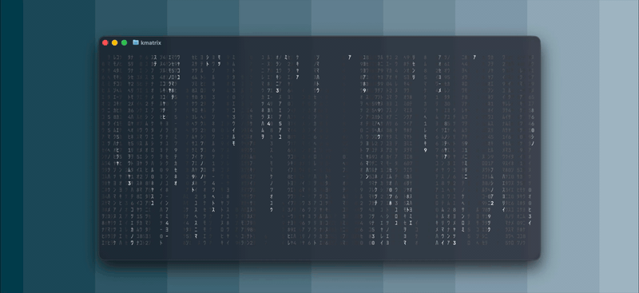

# kmatrix

A smooth, delta-rendered matrix rain effect, written in Python.

Six color themes, reverse fall, speed control, character mutation, sparse density and long trails.

See `MANUAL.md` for full installation, controls, and file reference.

## How does it look?

<p align="center">

</p>

#### white theme, sparsity off, mutation off.

## Quick start

Requires Python 3.13+.

```bash
git clone https://github.com/DamienBlackwood/kmatrix.git
cd kmatrix
pipx install .
```

Then run `kmatrix` from anywhere. Use `?` while running to toggle the help overlay, and `h` for settings.

## Inspiration

Inspired by [cmatrix](https://github.com/abishekvashok/cmatrix).

## Methodology

All code written by me, drawing from existing research but implemented independently.
